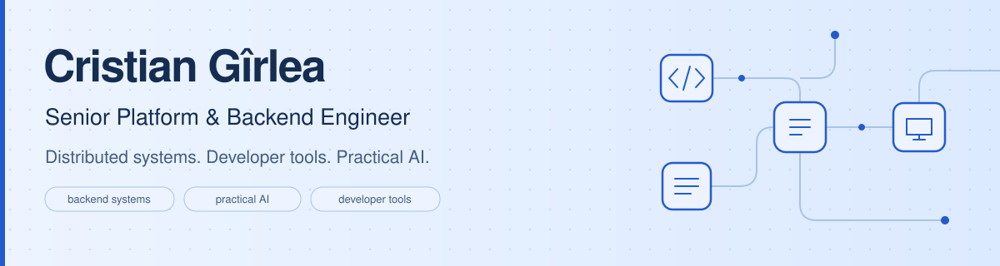

<picture>
  <source media="(prefers-color-scheme: dark)" srcset="assets/header-dark.svg">
  
</picture>

  
  
  

<ul>
  <li>Building <a href="https://tidedesk.app">TideDesk</a>, remote desktop software for reaching your own Windows computers, with screen sharing, input control, and system audio streaming.</li>
  <li>Building <a href="https://github.com/cristiangirlea/php-python-ai-bridge">PHP–Python AI Bridge</a> and <a href="https://github.com/cristiangirlea/claude-sdlc-kit">claude-sdlc-kit</a>: practical AI integrations and reusable development workflows.</li>
  <li>Working across backend services, distributed systems, cloud platforms, and developer tooling. I care about clear interfaces, useful tests, and how systems behave when something fails.</li>
</ul>

<a href="https://cristiangirlea.ro">Portfolio &amp; CV</a> · <a href="https://www.linkedin.com/in/cristian-girlea/">LinkedIn</a> · <a href="mailto:contact@cristiangirlea.ro">Get in touch</a>

<h2>Built by me</h2>

Projects I build and maintain, from desktop software to AI integrations and developer tools.

<h3>🖥️ <a href="https://github.com/cristiangirlea/tidedesk"><code>TideDesk</code></a> · Your computers, within reach</h3>
<blockquote>
Remote desktop for Windows with screen sharing, keyboard and mouse control, system audio streaming, and optional text clipboard sharing.
</blockquote>

  
  
  
  

<ul>
  <li>H.264 video and Opus audio over encrypted QUIC connections, with separate streams for screen, input, and sound.</li>
  <li>Windows host and viewer in one application, plus optional clipboard sharing and configurable controls.</li>
  <li>Source-available and free for personal, non-commercial use. Currently an early alpha; other platforms are on the roadmap.</li>
</ul>

<a href="https://tidedesk.app">Website</a> · <a href="https://github.com/cristiangirlea/tidedesk/releases">Download for Windows</a> · <a href="https://github.com/cristiangirlea/tidedesk">Source</a>

<h3>🧩 <a href="https://github.com/cristiangirlea/php-python-ai-bridge"><code>PHP–Python AI Bridge</code></a></h3>
<blockquote>
Call Python AI tasks from PHP without holding the original HTTP request open. Submit work, poll progress, receive typed results, and cancel when needed.
</blockquote>

  
  
  
  
  

<ul>
  <li>A framework-independent PHP client, a Python task service, and a FrankenPHP worker-mode example.</li>
  <li>Reranking, embeddings, and redaction with optional local ONNX inference; no hosted AI account required.</li>
  <li>Bounded concurrency, cancellation, crash detection, and deterministic fault tests across PHP 8.2–8.5.</li>
  <li>MCP tools expose the same task protocol. Experimental prototype with in-memory jobs; not a production job queue.</li>
</ul>

<a href="https://github.com/cristiangirlea/php-python-ai-bridge#try-it-with-docker">Try with Docker</a> · <a href="https://github.com/cristiangirlea/php-python-ai-bridge/blob/main/docs/integration.md">Integration guide</a>

<h3>🛠️ <a href="https://github.com/cristiangirlea/claude-sdlc-kit"><code>claude-sdlc-kit</code></a></h3>
<blockquote>
A reusable software development lifecycle for coding agents: specify, plan, implement, review, verify, ship, and learn.
</blockquote>

  
  
  
  

<ul>
  <li>Reusable skills, roles, procedures, and templates, with a review or verification gate between stages.</li>
  <li>A local Markdown issue tracker and runtime scripts built on the Node.js standard library.</li>
  <li>Generated adapters for Claude Code and Codex from one source tree. Experimental community tooling.</li>
</ul>

<a href="https://github.com/cristiangirlea/claude-sdlc-kit#quick-start">Quick start</a> · <a href="https://github.com/cristiangirlea/claude-sdlc-kit/blob/main/docs/WALKTHROUGH.md">Walkthrough</a>

<h2>Open-source contributions</h2>

My public contributions span <a href="https://github.com/golang/go">Go</a> (including its network and text libraries), Canonical, Temporal, Weaviate, PrefectHQ, Mondoo, and PostHog. The table distinguishes merged changes, open work, and closed submissions that were not merged.

  
  
  
  
  
  
  

<!-- merged-prs:start -->

  
  
  

<table>
<thead><tr><th>Project</th><th>★</th><th>Merged</th><th>Open</th><th>Closed, unmerged</th></tr></thead>
<tbody>
<tr><td><a href="https://github.com/golang/go"><code>golang/go</code></a></td><td align="right">139,054</td><td align="right"><a href="https://go-review.googlesource.com/q/%28change%3A833064%20OR%20change%3A833584%29">2</a></td><td align="right"><a href="https://go-review.googlesource.com/q/%28change%3A833564%20OR%20change%3A833565%20OR%20change%3A833724%20OR%20change%3A834124%20OR%20change%3A834144%20OR%20change%3A837365%20OR%20change%3A837366%20OR%20change%3A839745%20OR%20change%3A839746%20OR%20change%3A839785%20OR%20change%3A839786%20OR%20change%3A839885%29">12</a></td><td align="right">0</td></tr>
<tr><td><a href="https://github.com/docker/docs"><code>docker/docs</code></a></td><td align="right">4,660</td><td align="right">0</td><td align="right">0</td><td align="right"><a href="https://github.com/docker/docs/pulls?q=is%3Apr+is%3Aclosed+is%3Aunmerged+author%3Acristiangirlea">1</a></td></tr>
<tr><td><a href="https://github.com/canonical/cloud-init"><code>canonical/cloud-init</code></a></td><td align="right">3,823</td><td align="right">0</td><td align="right"><a href="https://github.com/canonical/cloud-init/pulls?q=is%3Apr+is%3Aopen+author%3Acristiangirlea">2</a></td><td align="right">0</td></tr>
<tr><td><a href="https://github.com/golang/net"><code>golang/net</code></a></td><td align="right">3,045</td><td align="right">0</td><td align="right"><a href="https://go-review.googlesource.com/q/%28change%3A839805%29">1</a></td><td align="right">0</td></tr>
<tr><td><a href="https://github.com/temporalio/sdk-typescript"><code>temporalio/sdk-typescript</code></a></td><td align="right">925</td><td align="right">0</td><td align="right"><a href="https://github.com/temporalio/sdk-typescript/pulls?q=is%3Apr+is%3Aopen+author%3Acristiangirlea">1</a></td><td align="right">0</td></tr>
<tr><td><a href="https://github.com/golang/text"><code>golang/text</code></a></td><td align="right">810</td><td align="right">0</td><td align="right"><a href="https://go-review.googlesource.com/q/%28change%3A839825%20OR%20change%3A839845%29">2</a></td><td align="right">0</td></tr>
<tr><td><a href="https://github.com/mondoohq/cnspec"><code>mondoohq/cnspec</code></a></td><td align="right">441</td><td align="right">0</td><td align="right"><a href="https://github.com/mondoohq/cnspec/pulls?q=is%3Apr+is%3Aopen+author%3Acristiangirlea">1</a></td><td align="right">0</td></tr>
<tr><td><a href="https://github.com/canonical/chisel"><code>canonical/chisel</code></a></td><td align="right">427</td><td align="right">0</td><td align="right"><a href="https://github.com/canonical/chisel/pulls?q=is%3Apr+is%3Aopen+author%3Acristiangirlea">1</a></td><td align="right">0</td></tr>
<tr><td><a href="https://github.com/canonical/operator"><code>canonical/operator</code></a></td><td align="right">267</td><td align="right">0</td><td align="right"><a href="https://github.com/canonical/operator/pulls?q=is%3Apr+is%3Aopen+author%3Acristiangirlea">1</a></td><td align="right"><a href="https://github.com/canonical/operator/pulls?q=is%3Apr+is%3Aclosed+is%3Aunmerged+author%3Acristiangirlea">1</a></td></tr>
<tr><td><a href="https://github.com/yiisoft/yii2-framework"><code>yiisoft/yii2-framework</code></a></td><td align="right">234</td><td align="right">0</td><td align="right">0</td><td align="right"><a href="https://github.com/yiisoft/yii2-framework/pulls?q=is%3Apr+is%3Aclosed+is%3Aunmerged+author%3Acristiangirlea">2</a></td></tr>
<tr><td><a href="https://github.com/canonical/pebble"><code>canonical/pebble</code></a></td><td align="right">210</td><td align="right">0</td><td align="right"><a href="https://github.com/canonical/pebble/pulls?q=is%3Apr+is%3Aopen+author%3Acristiangirlea">1</a></td><td align="right">0</td></tr>
<tr><td><a href="https://github.com/weaviate/weaviate-helm"><code>weaviate/weaviate-helm</code></a></td><td align="right">69</td><td align="right">0</td><td align="right"><a href="https://github.com/weaviate/weaviate-helm/pulls?q=is%3Apr+is%3Aopen+author%3Acristiangirlea">3</a></td><td align="right">0</td></tr>
<tr><td><a href="https://github.com/PostHog/posthog-go"><code>PostHog/posthog-go</code></a></td><td align="right">55</td><td align="right"><a href="https://github.com/PostHog/posthog-go/pulls?q=is%3Apr+is%3Amerged+author%3Acristiangirlea">1</a></td><td align="right">0</td><td align="right">0</td></tr>
<tr><td><a href="https://github.com/temporalio/terraform-provider-temporalcloud"><code>temporalio/terraform-provider-temporalcloud</code></a></td><td align="right">26</td><td align="right">0</td><td align="right"><a href="https://github.com/temporalio/terraform-provider-temporalcloud/pulls?q=is%3Apr+is%3Aopen+author%3Acristiangirlea">1</a></td><td align="right">0</td></tr>
<tr><td><a href="https://github.com/canonical/traefik-k8s-operator"><code>canonical/traefik-k8s-operator</code></a></td><td align="right">17</td><td align="right">0</td><td align="right"><a href="https://github.com/canonical/traefik-k8s-operator/pulls?q=is%3Apr+is%3Aopen+author%3Acristiangirlea">1</a></td><td align="right">0</td></tr>
</tbody></table>

<strong>Merged through Go Gerrit:</strong> <a href="https://go-review.googlesource.com/c/go/+/833064">golang/go#81545</a>, <a href="https://go-review.googlesource.com/c/go/+/833584">golang/go#81562</a>. GitHub closes these imported PRs without setting its merged flag.

Public upstream PRs authored by me. Open includes 2 drafts; closed, unmerged submissions are not counted as accepted changes. Stars belong to the upstream repositories. <a href="scripts/refresh-profile.py">Selection rules</a> · Refreshed 2026-09-27 16:48 UTC by <a href=".github/workflows/refresh.yml">GitHub Actions</a>.

<!-- merged-prs:end -->

<strong>Issue reports:</strong> <a href="https://github.com/PrefectHQ/fastmcp/issues/5302">PrefectHQ / FastMCP</a> — reported a Windows type-checking failure caused by the unavailable <code>fcntl.flock</code> API. Issue reports are separate from the PR totals above.

<h2>Tech</h2>

  
  
  
  
  
  
  
  
  
  

<h2>Contributions</h2>

  <picture>
    <source media="(prefers-color-scheme: dark)" srcset="assets/snake-dark.svg">
    
  </picture>

🐍 Generated daily from my GitHub contribution graph by <a href=".github/workflows/refresh.yml">GitHub Actions</a>.

If a project is useful to you, a star, issue, or contribution is always welcome. For backend, platform, or developer-tooling work, <a href="mailto:contact@cristiangirlea.ro">let's talk</a>.

