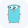
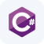
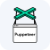
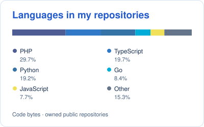
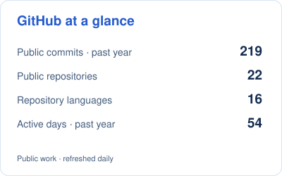
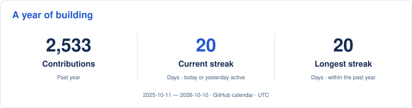

<picture>
  <source media="(prefers-color-scheme: dark)" srcset="assets/header-dark.svg">
  
</picture>

  
  

<ul>
  <li>Building <a href="https://tidedesk.app">TideDesk</a>, remote desktop software for reaching your own Windows computers, with screen sharing, input control, system audio, file transfer and chat.</li>
  <li>Building <a href="https://github.com/cristiangirlea/php-python-ai-bridge">PHP–Python AI Bridge</a> and <a href="https://github.com/cristiangirlea/claude-sdlc-kit">claude-sdlc-kit</a>: practical AI integrations and reusable development workflows.</li>
  <li>Working across backend services, distributed systems, cloud platforms, and developer tooling. I care about clear interfaces, useful tests, and how systems behave when something fails.</li>
</ul>

<h2>Connect with me</h2>

  
  
  

<a href="https://cristiangirlea.ro">Portfolio &amp; CV</a> · <a href="https://www.linkedin.com/in/cristian-girlea/">LinkedIn</a> · <a href="mailto:contact@cristiangirlea.ro">Get in touch</a>

<h2>Built by me</h2>

Projects I build and maintain, from desktop software to AI integrations and developer tools.

<h3>🫖 <a href="https://adanext.si/"><code>Ada Next</code></a> · Learn AI by fixing a bot</h3>
<blockquote>
Fix the Bot is a free browser game that teaches how AI applications work by repairing Ada, the support bot of a fictional tea shop, one ticket at a time.
</blockquote>
<ul>
  <li>Learning tracks for children, everyday AI users and developers, covering prompts, context, retrieval, agents, testing, security and cost.</li>
  <li>Checkpoint certificates, progress saved on the device, and offline play after loading.</li>
  <li>No accounts, ads or tracking. The game uses prewritten content; children's answers are not sent to an AI.</li>
</ul>

<a href="https://adanext.si/">Website</a> · <a href="https://play.adanext.si/">Play Fix the Bot</a>

<h3>🖥️ <a href="https://github.com/cristiangirlea/tidedesk"><code>TideDesk</code></a> · Your computers, within reach</h3>
<blockquote>
Remote desktop for Windows with screen sharing, keyboard and mouse control, system audio, file transfer and chat, plus an experimental Android viewer.
</blockquote>

  
  
  
  

<ul>
  <li>H.264 video and Opus audio over encrypted QUIC connections, with separate streams for screen, input, and sound.</li>
  <li>Windows host and viewer in one application, available through the Microsoft Store and portable releases. An experimental Android viewer is also available.</li>
  <li>Free for personal, non-commercial use, with paid licensing for business use. I own the application, connection services, release delivery, website and commercial sales setup.</li>
</ul>

<a href="https://tidedesk.app">Website</a> · <a href="https://apps.microsoft.com/detail/9PLH1HWXHB3Q">Microsoft Store</a> · <a href="https://github.com/cristiangirlea/tidedesk/releases">Portable releases &amp; Android preview</a>

<h3>🧩 <a href="https://github.com/cristiangirlea/php-python-ai-bridge"><code>PHP–Python AI Bridge</code></a></h3>
<blockquote>
Call Python AI tasks from PHP without holding the original HTTP request open. Submit work, poll progress, receive typed results, and cancel when needed.
</blockquote>

  
  
  
  
  

<ul>
  <li>A framework-independent PHP client, a Python task service, and a FrankenPHP worker-mode example.</li>
  <li>Reranking, embeddings, and redaction with optional local ONNX inference; no hosted AI account required.</li>
  <li>Bounded concurrency, cancellation, crash detection, and deterministic fault tests across PHP 8.2–8.5.</li>
  <li>MCP tools expose the same task protocol. Experimental prototype with in-memory jobs; not a production job queue.</li>
</ul>

<a href="https://github.com/cristiangirlea/php-python-ai-bridge#try-it-with-docker">Try with Docker</a> · <a href="https://github.com/cristiangirlea/php-python-ai-bridge/blob/main/docs/integration.md">Integration guide</a>

<h3>🛠️ <a href="https://github.com/cristiangirlea/claude-sdlc-kit"><code>claude-sdlc-kit</code></a></h3>
<blockquote>
A reusable software development lifecycle for coding agents: specify, plan, implement, review, verify, ship, and learn.
</blockquote>

  
  
  
  

<ul>
  <li>Reusable skills, roles, procedures, and templates, with a review or verification gate between stages.</li>
  <li>A local Markdown issue tracker and runtime scripts built on the Node.js standard library.</li>
  <li>Generated adapters for Claude Code and Codex from one source tree. Experimental community tooling.</li>
</ul>

<a href="https://github.com/cristiangirlea/claude-sdlc-kit#quick-start">Quick start</a> · <a href="https://github.com/cristiangirlea/claude-sdlc-kit/blob/main/docs/WALKTHROUGH.md">Walkthrough</a>

<h2>Open-source contributions</h2>

My public contributions span <a href="https://github.com/golang/go">Go</a> (including its network and text libraries), Laravel, Canonical, Temporal, Weaviate, PrefectHQ, Mondoo, and PostHog. <a href="https://github.com/pulls?q=is%3Apr+author%3Acristiangirlea">Browse my contribution history</a>.

  
  
  
  
  
  
  

<strong>Issue reports:</strong> <a href="https://github.com/PrefectHQ/fastmcp/issues/5302">PrefectHQ / FastMCP</a> — reported a Windows type-checking failure caused by the unavailable <code>fcntl.flock</code> API. Issue reports are separate from the PR totals above.

<h2>Languages, frameworks and tools</h2>

Across professional work and personal projects.

<h3>Languages and runtimes</h3>

  
  
  
  
  
  
  
  
  
  
  
  
  
  

Go · Python · TypeScript · JavaScript · PHP · SQL · Rust · C# · Java · Kotlin · Perl · Node.js · HTML · CSS · PowerShell · V8

<h3>Backend frameworks and APIs</h3>

  
  
  
  
  
  
  
  
  
  

FastAPI · Flask · Fiber · Express.js · NestJS · Laravel · Symfony · CodeIgniter · CakePHP · Yii2 · Pydantic · FrankenPHP · API Platform · REST · SOAP · gRPC / grpc-go · Protobuf · ConnectRPC · OpenAPI / Swagger · JSON-RPC · webhooks · async jobs

<h3>Frontend and UI</h3>

  
  
  
  
  
  
  
  

React · Next.js · Vue.js · Angular · AngularJS · jQuery · Bootstrap · Tailwind CSS · Module Federation

<h3>Databases, search and messaging</h3>

  
  
  
  
  
  
  
  
  
  
  
  

PostgreSQL · MySQL · MariaDB · SQL Server · MongoDB · Redis · Elasticsearch · DynamoDB · Supabase · Prisma · Kafka · RabbitMQ · Beanstalkd · Hatchet · SQS queues

<h3>Cloud and hosting</h3>

  
  
  
  
  
  

AWS · Azure · Google Cloud · DigitalOcean · Cloudflare / Cloudflare Pages · Linux · AWS EKS · EC2 · Lambda · SAM · CodeBuild · S3 · RDS · EventBridge · SNS · SQS · ECR · IAM · Secrets Manager · QuickSight · Azure AKS · Azure Functions · Azure Key Vault

<h3>Containers, infrastructure and GitOps</h3>

  
  
  
  

Docker / Docker Compose · Kubernetes · Terraform · OpenTofu · Kustomize · Flux · Argo CD · KEDA · Skaffold · Minikube · K9s

<h3>Delivery and testing</h3>

  
  
  
  
  
  
  
  
  
  

Git · GitHub Actions · GitLab CI · Azure DevOps Pipelines · Jenkins · Bitbucket CI/CD · Nx · Playwright · Puppeteer · pytest · Jest · PHPUnit · Go test · canary testing · end-to-end testing · fault-injection testing

<h3>Observability and reliability</h3>

  
  
  
  

Prometheus · Grafana · OpenTelemetry · Sentry · CloudWatch

<h3>AI, inference and agent tooling</h3>

  

MLflow · ONNX Runtime · Ollama · LiteLLM · OpenAI APIs · Anthropic API · Foundry-hosted models · RAG · embeddings and semantic search · cross-encoder reranking · LLM evaluation / LLM-as-judge · synthetic datasets · structured outputs and guardrails · MCP clients and servers · Claude Code · Codex · Cursor · Gemini CLI · opencode · VS Code · agent skills, roles and hooks

<h3>Microsoft, identity and security</h3>

Power Apps · Canvas Apps · Model-Driven Apps · Power Automate · Dataverse / CDS · PCF controls · Dataverse plug-ins · Microsoft 365 / Office 365 · SharePoint · Azure AD · Active Directory · OAuth 2.0 / OIDC · SSO · JWT · RBAC / ABAC · multi-tenancy · SOPS · PKI · AD CS · SCEP · Group Policy

<h3>Desktop, games and product integrations</h3>

  
  
  

Unity 6 · URP / IL2CPP · Android · Windows · QUIC · H.264 / Opus · STUN / NAT traversal · Google Play Billing · Stripe Connect · Paddle · GA4 · Google Tag Manager · OneTrust · XML / UBL

<h2>GitHub activity</h2>

  <picture>
    <source media="(prefers-color-scheme: dark)" srcset="assets/languages-dark.svg">
    
  </picture>
  <picture>
    <source media="(prefers-color-scheme: dark)" srcset="assets/stats-dark.svg">
    
  </picture>

  <picture>
    <source media="(max-width: 480px) and (prefers-color-scheme: dark)" srcset="assets/activity-mobile-dark.svg">
    <source media="(max-width: 480px)" srcset="assets/activity-mobile-light.svg">
    <source media="(prefers-color-scheme: dark)" srcset="assets/activity-dark.svg">
    
  </picture>

Language percentages describe code in my public, owned, non-fork, non-archived repositories. Activity and streaks reflect the past year of my GitHub contribution calendar, using UTC days. <a href="data/profile-cards.json">View the snapshot</a> · Updated daily.

<h2>Contributions</h2>

  <picture>
    <source media="(prefers-color-scheme: dark)" srcset="assets/snake-dark.svg">
    
  </picture>

🐍 Generated daily from my GitHub contribution graph by <a href=".github/workflows/refresh.yml">GitHub Actions</a>.

If a project is useful to you, a star, issue, or contribution is always welcome. For backend, platform, or developer-tooling work, <a href="mailto:contact@cristiangirlea.ro">let's talk</a>.

